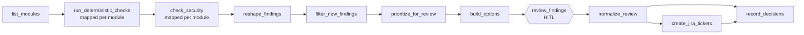

# tf-sentinel

**Human-in-the-loop Terraform auditing on Apache Airflow.**

tf-sentinel audits Terraform across multiple repositories and catches problems before they turn into incidents: failed validation, lint issues, missing deletion safeguards, and risky security settings. Deterministic checks and an LLM review find the issues. A human makes the call on every one: create a Jira ticket, dismiss it, or leave it for later.

It never changes infrastructure. It only reports, and only what a person approves becomes a ticket.

> Built for the **Beyond the DAG** hackathon by Astronomer, Track 03: Human in the Loop.

---

## How it works



1. **Per-module checks.** Every module gets its own mapped task, labelled with the module name in the Airflow UI. It runs `terraform validate`, tflint, and a deletion-protection check.
2. **LLM security review.** Modules that pass validation are reviewed by an LLM for open network access, missing encryption and missing public-access blocking. Modules that fail validation skip this step, so no money is spent judging broken code.
3. **Findings with stable IDs.** All results are combined into one list. Each finding gets an ID that stays the same between runs. For LLM findings, the ID is based on the resource and category rather than the LLM's wording, which changes from run to run.
4. **Only new findings.** Findings that have already been decided are filtered out. The rest are sorted by severity, highest first, and capped per review.
5. **Human review.** A single HITL step pauses the run until someone decides.
6. **Act and remember.** Tickets are created only for approved findings, and every decision is saved for the next run.

## The review

Each finding appears twice in the review form, as **TICKET** and as **DISMISS**:

| You tick | Result | Comes back next run? |
|---|---|---|
| TICKET | A Jira issue is created, labelled `tf-sentinel` | No |
| DISMISS | Closed without a ticket | No |
| Neither | Nothing happens | Yes |
| Both | Treated as no decision | Yes |

Nothing is decided by default. A finding disappears only when someone makes a clear choice about it.

## Design principles

- **Humans decide, the system recommends.** No automated infrastructure changes, ever.
- **Fail closed.** An unclear or conflicting decision leads to no action.
- **Deterministic before LLM.** Cheap, exact checks run first, and the LLM judges only valid code.
- **The review step is replaceable.** Downstream tasks only see a simple set of decisions (`ticket`, `dismiss`, `conflict`), so the review can move to Slack without changing the Jira or tracking logic.

---

## Quick start

### Prerequisites

- Docker and Docker Compose
- An API key for an OpenAI-compatible LLM endpoint (developed with [Nebius AI Studio](https://studio.nebius.com))
- A Jira Cloud site with a project and an [API token](https://id.atlassian.com/manage-profile/security/api-tokens)

### Setup

```bash
git clone [REPO_URL]
cd [REPO_FOLDER]
docker compose up -d
```

Open `http://localhost:[PORT]` and log in with `[USERNAME]` / `[PASSWORD]`.

Add two connections under **Admin → Connections**:

| Connection ID | Settings |
|---|---|
| `nebius_default` | `[CONNECTION TYPE]`, with your LLM API key in `[FIELD]` and base URL `[URL]` in `[FIELD]` |
| `jira_default` | Login: your Jira email. Password: your Jira API token |

Then set these constants in `dags/tf_sentinel_audit.py`:

```python
JIRA_SITE = "https://your-site.atlassian.net"
JIRA_PROJECT_KEY = "YOURKEY"
```

### Run it

1. Trigger **`tf_sentinel_audit`**. The trigger form has one option, `review_limit`: the default is 15, and `0` shows every finding.
2. When the run pauses at **`review_findings`**, open the task and decide on each finding.
3. Check Jira: only the findings you ticketed have issues, labelled `tf-sentinel`.
4. Trigger the DAG again. Findings you decided don't come back; only the ones you left undecided do.

Sample Terraform modules with deliberate issues are included in `data/sample-repos/`, so no real infrastructure is needed.

### Reset

Decisions are stored in `data/reviewed_findings.json`. Move or delete it to start fresh:

```bash
mv data/reviewed_findings.json data/reviewed_findings.bak.json
```

To find every ticket the DAG has created, use this JQL: `project = YOURKEY AND labels = tf-sentinel`.

---

## Configuration

| Setting | Where | Default | Purpose |
|---|---|---|---|
| `review_limit` | Trigger form (DAG param) | `15` | Maximum findings per review, highest severity first. `0` shows all. |
| `MODULES_ROOT` | DAG constant | `data/sample-repos/infra-modules/modules` | Folder of Terraform modules to audit |
| `JIRA_SITE`, `JIRA_PROJECT_KEY` | DAG constants | — | Where tickets are created |
| `REVIEWED_STORE` | DAG constant | `data/reviewed_findings.json` | Saved decisions |
| HITL timeout | `review_findings` task | 24 hours | How long the review waits for a response |

## Project structure

```
dags/
  tf_sentinel_audit.py        # The Airflow DAG
src/
  deterministic/              # validate, tflint, deletion-protection and graph checks
  llm_checks/                 # LLM security and duplicate checks
  diffing/                    # Git diff scoping
  llm/                        # LLM client
data/
  sample-repos/               # Synthetic Terraform modules with deliberate issues
.tflint.hcl                   # tflint rules
TODO.md                       # Known limitations and planned work
```

## Tests

The check modules have a pytest suite:

```bash
pytest
```

## Known limitations

- Only each module's `main.tf` is read, so modules split across several `.tf` files are only partly checked.
- The deletion-protection check looks at `skip_final_snapshot`, not the `deletion_protection` flag.
- Git diff scoping compares `HEAD~1` to `HEAD` and doesn't handle multi-commit PRs.
- LLM calls have no concurrency limit.
- If Jira ticket creation fails partway through, decisions from that run aren't saved. Tickets that were already created remain in Jira, and their findings come back for review on the next run.
- Two security issues on the same resource and in the same category count as one finding.

See `TODO.md` for the full list.

## Roadmap

- **Slack review:** make decisions from a Slack message instead of the Airflow UI.
- **Weekly full-repo scan:** a separate DAG that re-checks unchanged code for newly discovered risks.
- **Dry-run mode:** log the tickets that would be created, without calling Jira.
- **Save decisions per ticket,** so a partial Jira failure can't lose decisions.
- **Dependency graph checks** for version drift and orphaned modules across repos.

## Background

tf-sentinel started as `terraform-governance-agent`, a LangGraph prototype with checkpointed human-in-the-loop interrupts. For this project, the check logic was carried over and the orchestration was rebuilt on Airflow 3, using its native `HITLOperator`, dynamic task mapping and TaskFlow API.

## Built with

Apache Airflow 3 · LangChain · Terraform · tflint · Jira REST API

## License

MIT
